# deep-vis
关于深度学习可视化

## [Attention on VGGNet (Saliency)](https://github.com/raghakot/keras-vis/blob/master/examples/vggnet/attention.ipynb)
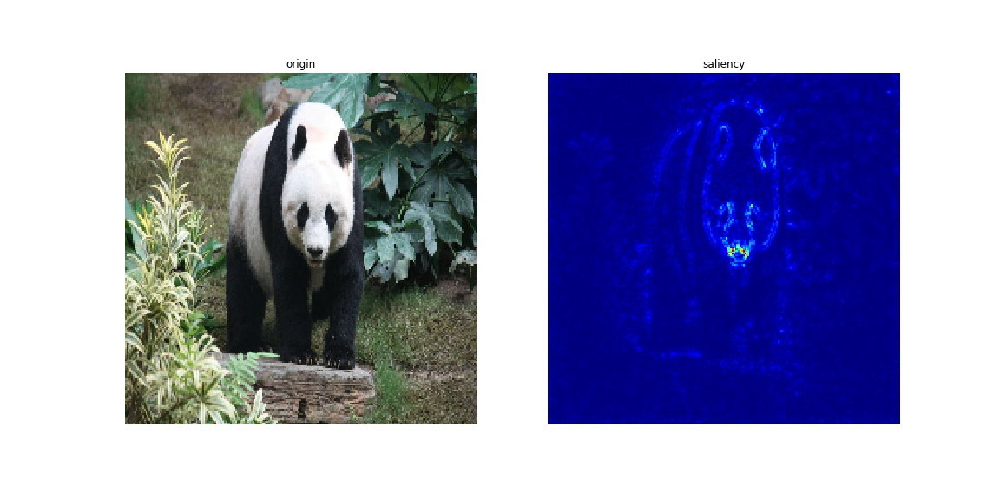
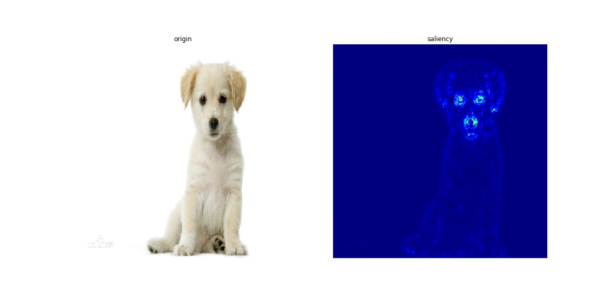
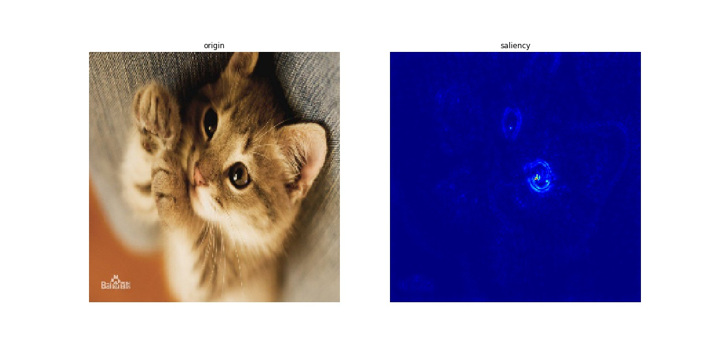

## [Attention on VGGNet (CAM)](https://github.com/raghakot/keras-vis/blob/master/examples/vggnet/attention.ipynb)
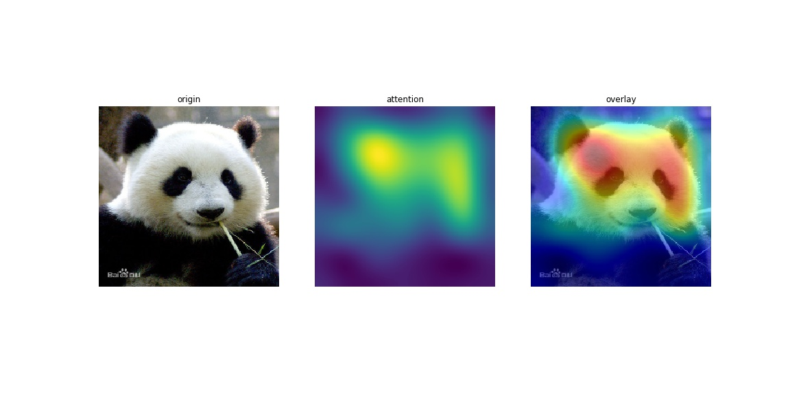
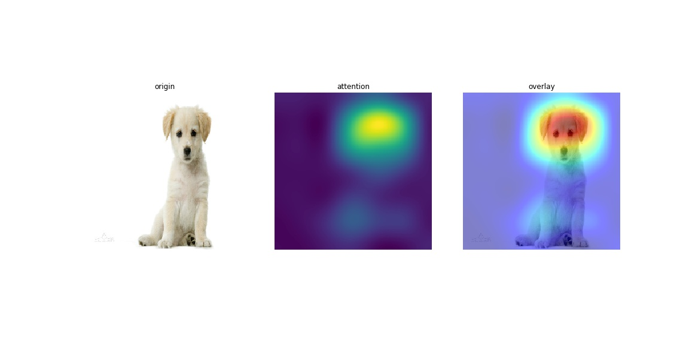
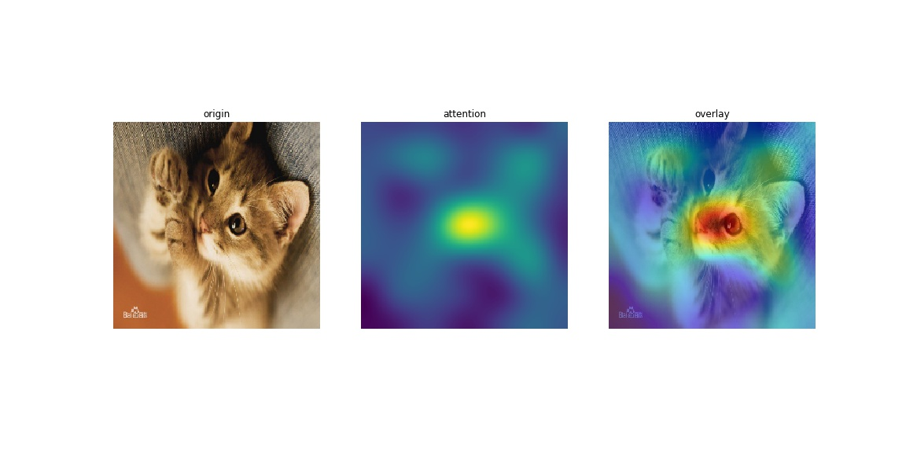

## [Activation Maximization on VGGNet](https://github.com/raghakot/keras-vis/blob/master/examples/vggnet/activation_maximization.ipynb)
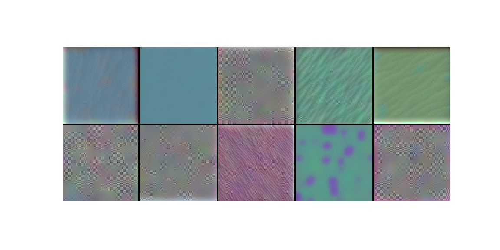
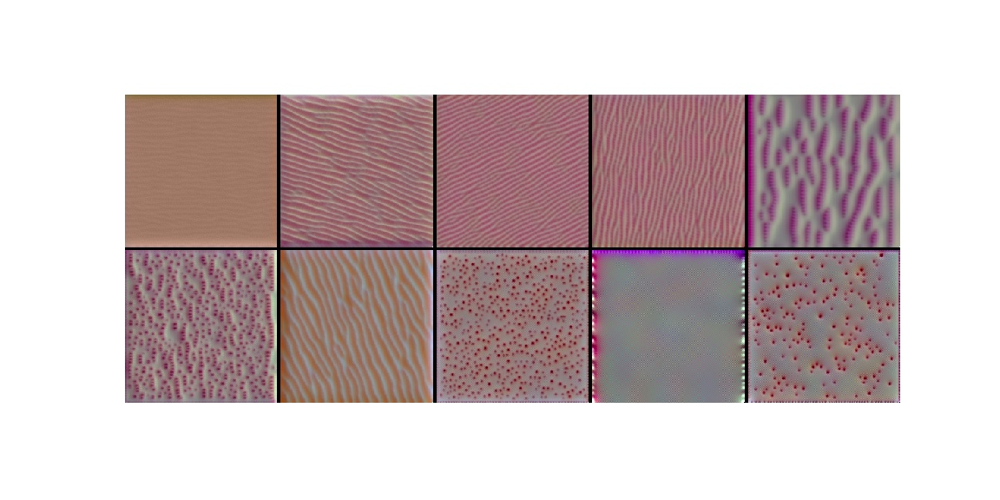
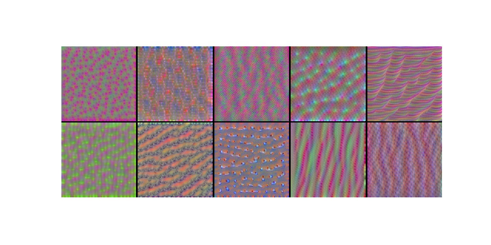
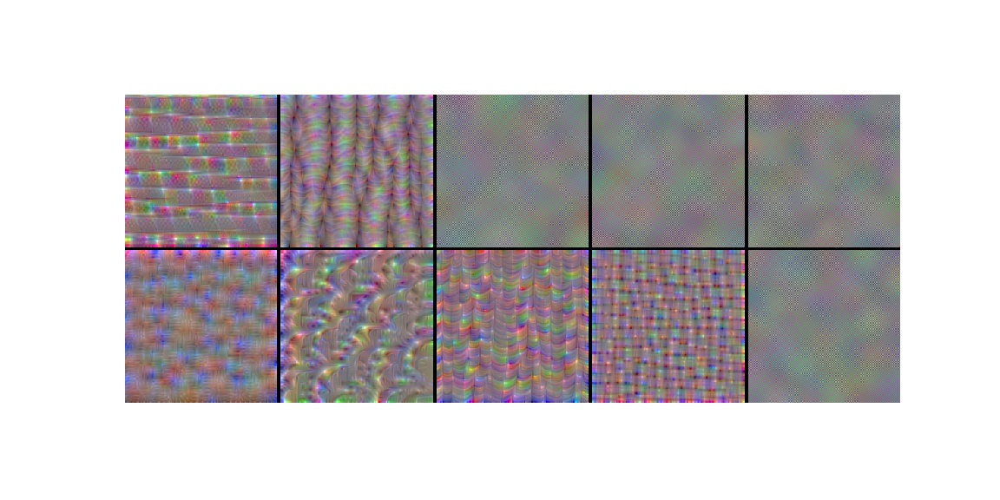
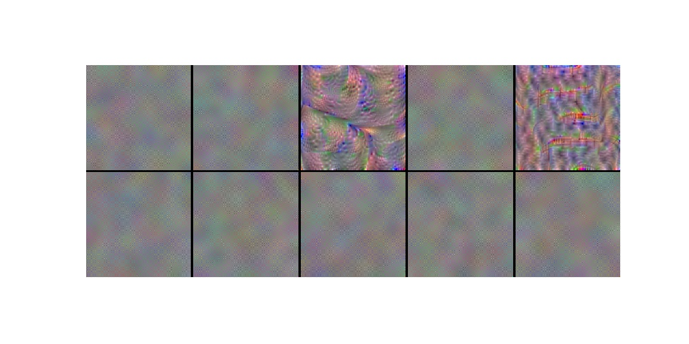
