# deep-vis

## [Attention (Saliency)](https://github.com/raghakot/keras-vis/blob/master/examples/vggnet/attention.ipynb)
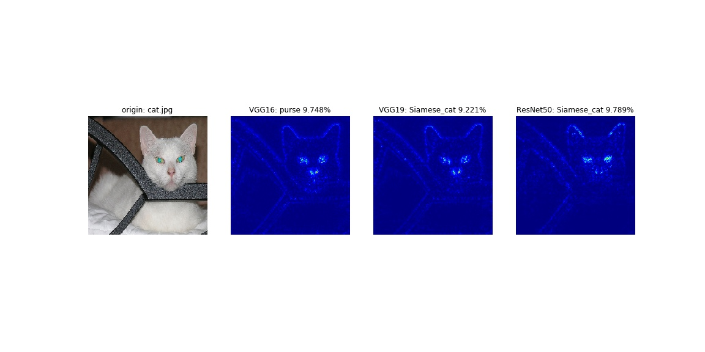
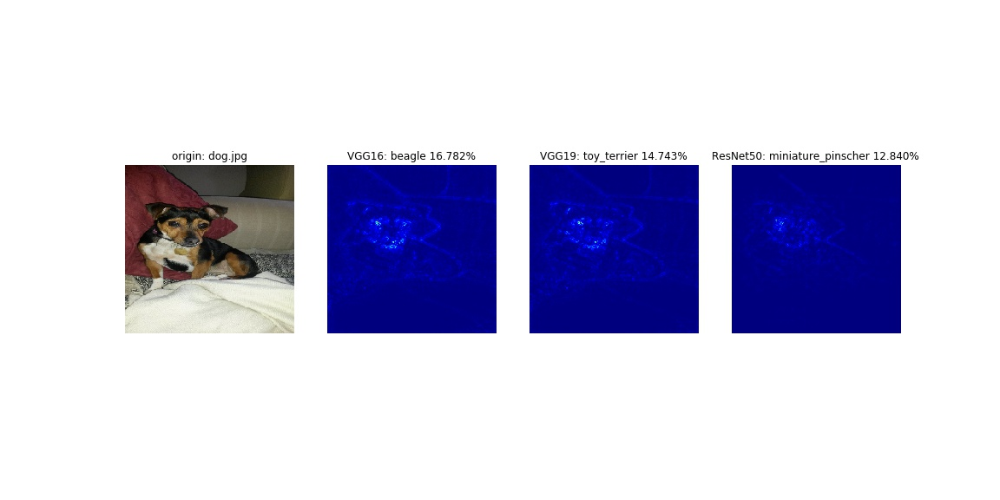
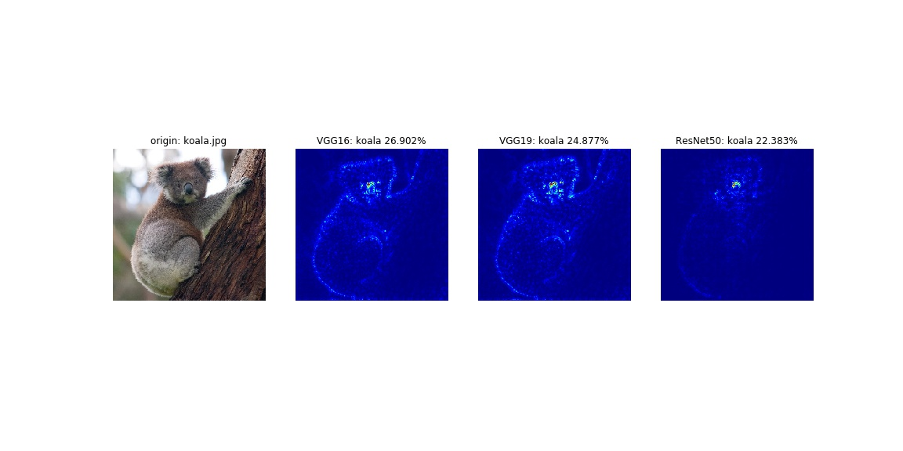

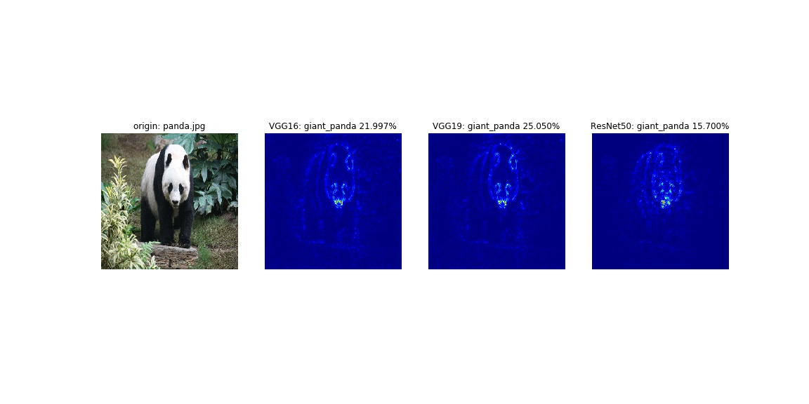
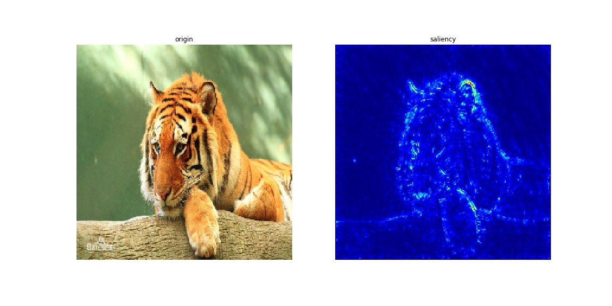

## [Attention (grad-CAM)](https://github.com/raghakot/keras-vis/blob/master/examples/vggnet/attention.ipynb)
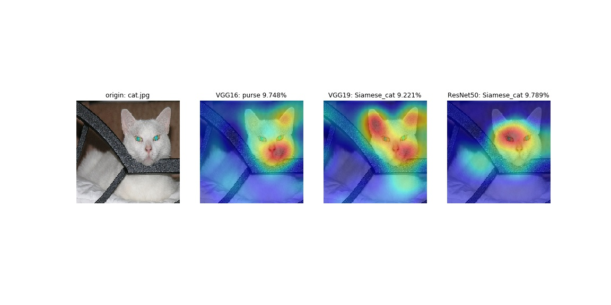
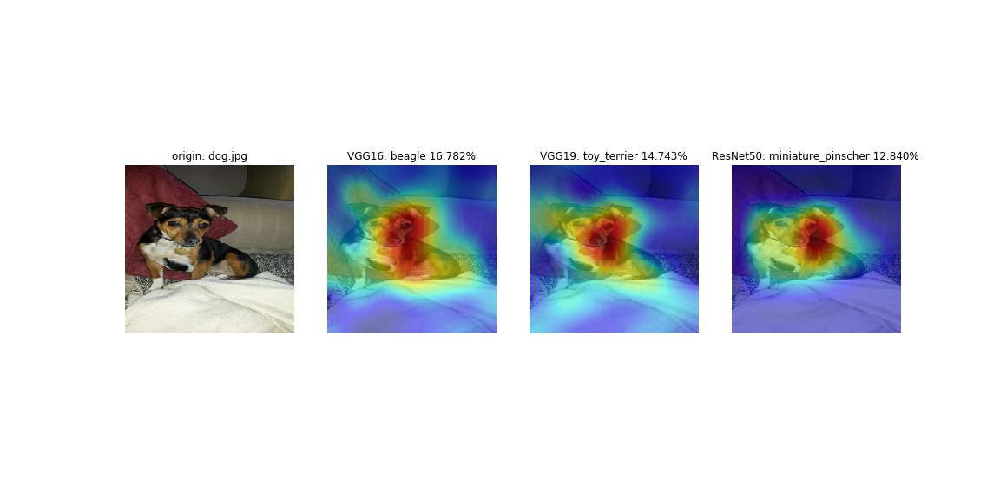
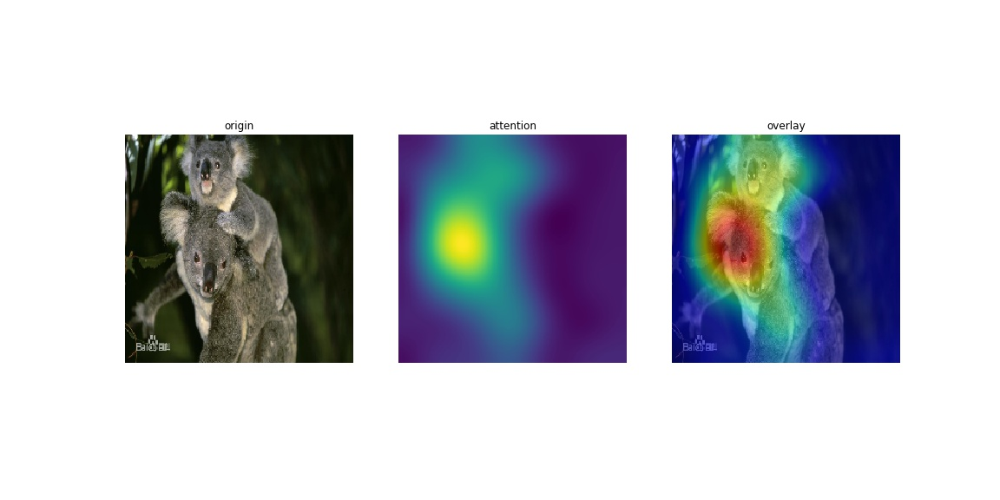
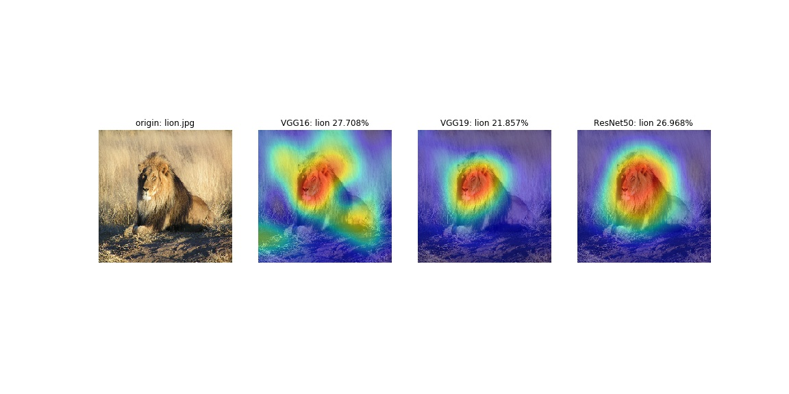
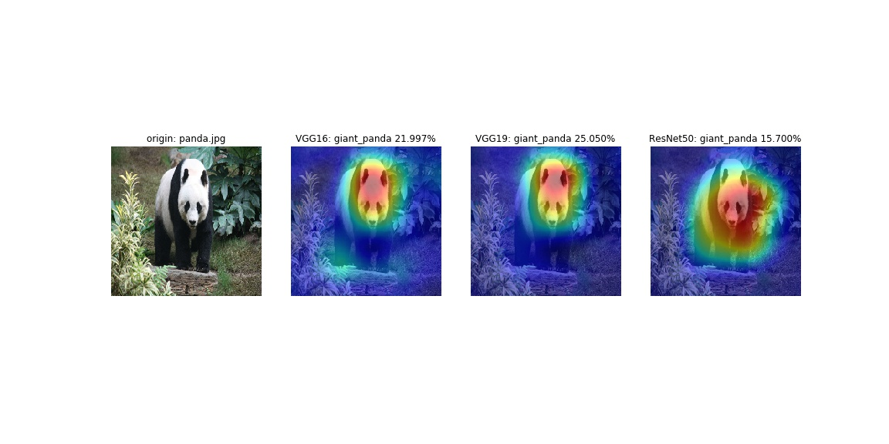
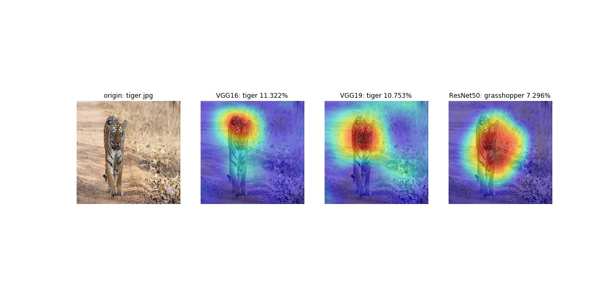

## [Activation Maximization](https://github.com/raghakot/keras-vis/blob/master/examples/vggnet/activation_maximization.ipynb)

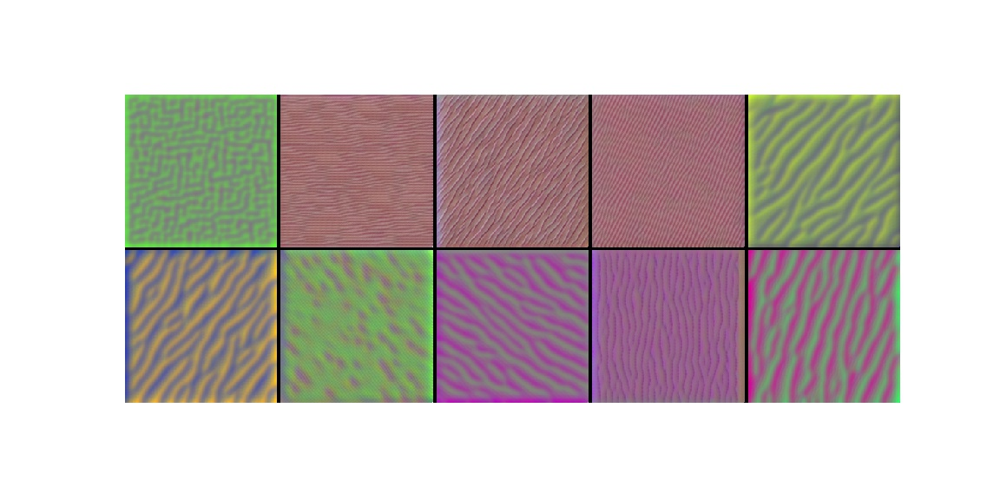
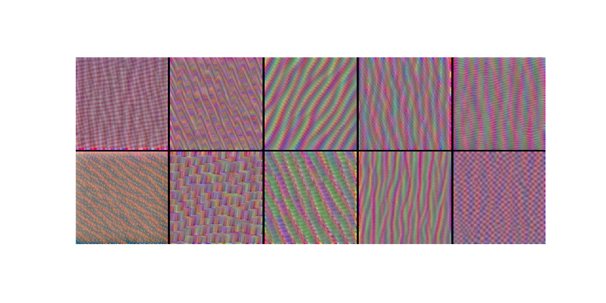
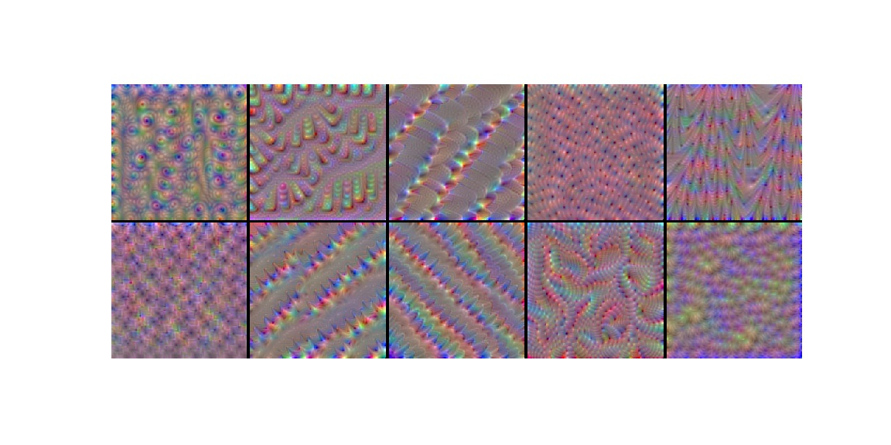
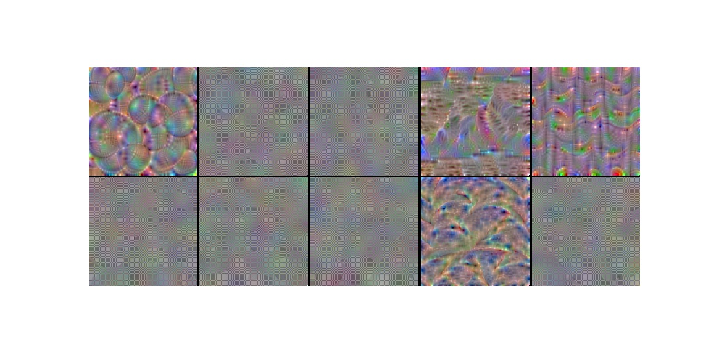
